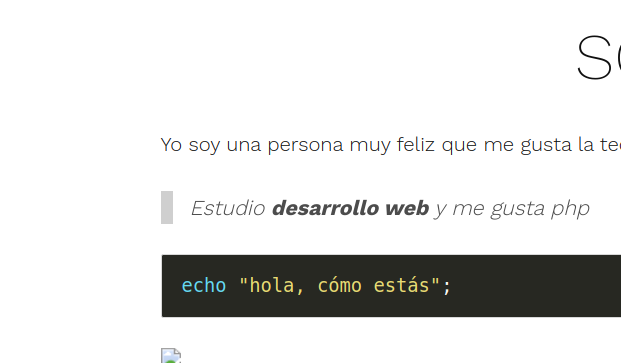

+++
title = 'Markdown'
date = 2023-10-11T19:11:19+02:00
draft = false
+++

# Sobre mí

Yo soy una persona muy feliz que me gusta la tecnología...    
> Estudio __desarrollo web__ y me gusta php

```php
echo "hola, cómo estás";
```

()
